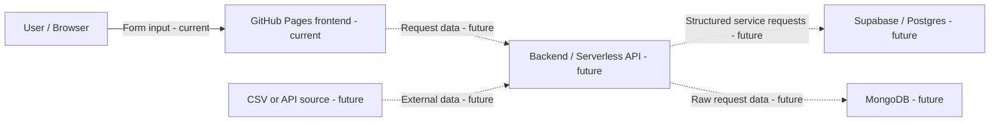

# Service Request Tracker

A small app that helps a service business track customer requests and decide what to follow up on next.

## Primary user
A small business owner who needs to review and follow up on incoming service requests.

## Current status
Class 1: sample data and app shell only. Database and external integrations will be added later.

## User Stories

- As a business owner, I want to see all service requests so I know what needs attention.
- As a business owner, I want to add a new service request so I do not lose customer information.
- As a business owner, I want to change a request’s status so I can track follow-ups.

## Success Measure

By the end of Class 6, the app will let the business owner add, view, and track service requests in one place.

## Data Contract

| Field | Example |
|---|---|
| id | req_001 |
| user_id | user_42 |
| title | Lawn mowing quote |
| status | new |
| source | form |
| created_at | 2026-08-26T09:00Z |
| customer_name | Jordan Smith |
| phone | 555-123-4567 |

## Architecture Map

## Live App

https://nosynosys.github.io/service-request-tracker/

## Class 3 — MongoDB Feature (Activity Notes)

### Architecture Decision
Service requests are canonical records owned by Supabase. Activity notes are a flexible, append-only log tied to each request, stored in MongoDB. Each note links back to its Supabase record via `app_record_id`.

### Data Flow
Browser → Vercel backend (`/api/activity-notes`) → verifies Supabase session → checks request ownership in Supabase → reads/writes MongoDB → returns only the requested user's data.

The MongoDB connection string is stored only in Vercel's environment variables — never in the frontend or repository.

### API Tests
- Valid GET request (signed in, real request id): 200 OK, returns notes
- Missing Authorization header: 401 Unauthorized
- Valid POST request: 201 Created, note saved and linked to request

## Class 4 — Data Integration Pipeline

### Source-to-Target Contract

**Source:** `sample-requests.csv` (simulates a partner data feed)
**Idempotency key:** `external_id` — uniquely identifies a source record; if seen again, it's treated as duplicate_or_unchanged.

| source_field | target_column | type | required | transformation_rule |
|---|---|---|---|---|
| external_id | (used as idempotency key only, not stored in Supabase) | text | yes | none |
| customer_name | customer_name | text | yes | trim whitespace |
| title | title | text | yes | trim whitespace |
| phone | phone | text | yes | none |
| status | status | text | yes | must be one of: new, contacted, scheduled; default "new" if blank |

### Validation Rules
**Structural:** `external_id`, `customer_name`, `title`, and `phone` must all be present and non-empty.
**Business rule:** `status` must be one of `new`, `contacted`, `scheduled`.

### Rejection Criteria
A record is **rejected** (permanent) if `customer_name`, `title`, or `phone` is missing/empty, or if `status` is not one of the allowed values.

### State Outcomes
- **accepted** — passed validation, new `external_id`, inserted into Supabase
- **duplicate_or_unchanged** — `external_id` already processed, no new Supabase row
- **rejected** — failed validation, specific rule recorded
- (no retryable_failure case in this CSV lab since there's no network call during load — only relevant for a live API source)
